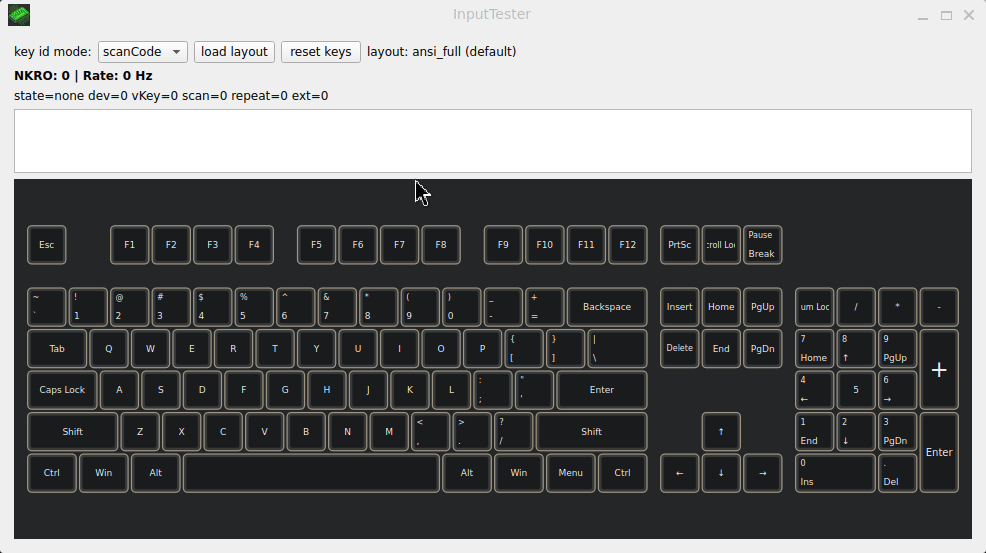
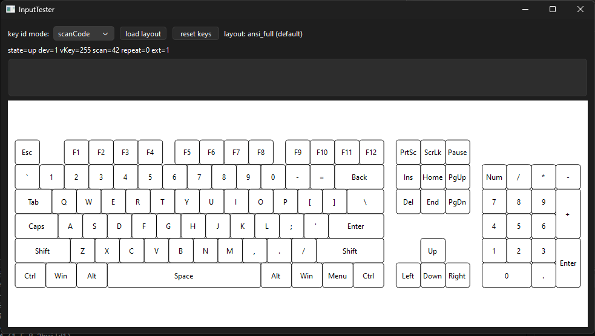
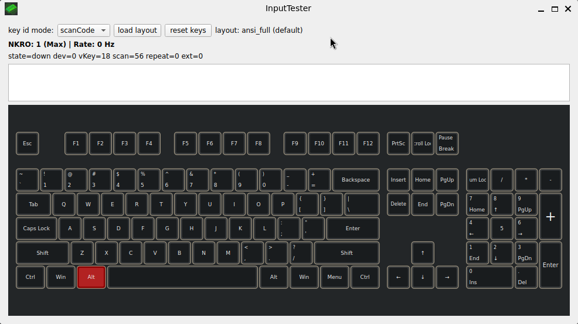
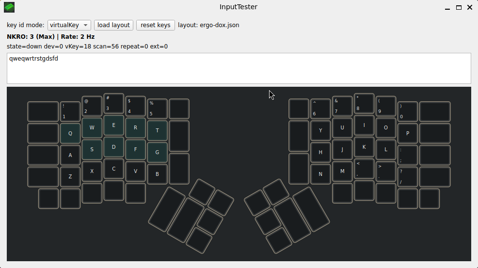

# InputTester

Cross-platform input capture playground (C++20 + Qt 6).
Focus: start with Qt input experiments, then move lower (WinAPI).

## Project Goals

- Understand the difference between `virtualKey` and `scanCode` and how they affect keyboard mapping.
- Build a portable event pipeline: platform backend -> queue -> UI, with zero allocations on the hot path.
- Separate keyboard geometry (KLE) from input code mapping.
- Start with keyboard/mouse, gamepad later.

## Status

- The app opens a Qt window and draws a full keyboard.
- **Visual Feedback**: Pressed keys light up red. Tested keys (pressed at least once) turn teal.
- **Metrics**: Real-time display of Polling Rate (Hz) and NKRO (Max simultaneous keys).
- Input capture is focus-only and works on Windows and Linux (Wayland).
- Keyboard layouts are loaded from KLE JSON. Mapping JSON is optional (auto-mapping based on labels).

## Screenshots






## Event Flow

platform backend -> inputEventSink -> inputEventQueue (SPSC) -> UI timer -> keyboardView

Why SPSC? The backend is a single producer and the UI thread is a single consumer, so a lock-free ring buffer keeps allocations and locks off the hot path.

## Requirements

- CMake 3.28+
- Qt 6.10.1 (Windows: msvc2022_64, Linux: gcc_64)
- Set your Qt path with `QT6_PREFIX` (presets read it; helper scripts export it).

## Build (Windows, MSVC 2022)

```powershell
$env:QT6_PREFIX="C:/Qt/6.10.1/msvc2022_64"
cmake --preset windows-release-msvc
cmake --build --preset windows-release-msvc
```

Run:
`out/build/windows-release-msvc/Release/InputTester.exe`

Note: Release builds use the Windows GUI subsystem (no console window). Debug keeps the console.

Deploy (Release):

```powershell
cmake --build --preset windows-release-msvc-deploy
```

Deploy (Debug):

```powershell
cmake --build --preset windows-debug-msvc-deploy
```

## Build (Linux / Ubuntu 22.04)

```bash
export QT6_PREFIX="$HOME/Qt/6.10.1/gcc_64"
cmake --preset linux-release-gcc
cmake --build --preset linux-release-gcc
./out/build/linux-release-gcc/InputTester
```


## One-Click Build

Linux:

```bash
./scripts/build-linux.sh Release
```

Windows:

```powershell
.\scripts\build-win.ps1 -Configuration Release -Deploy
```

Windows (preset deploy):

```powershell
cmake --build --preset windows-release-msvc-deploy
```

## Tests

```bash
export QT6_PREFIX="$HOME/Qt/6.10.1/gcc_64"
cmake --preset linux-debug-gcc
cmake --build --preset linux-debug-gcc
ctest --preset linux-debug-gcc
```

## Benchmarks (Linux)

This repo includes a small SPSC ringbuffer microbenchmark (`tests/spscBench.cpp`) adapted from the CppCon 2023 material by Charles Frasch.

Build and run:

```bash
cmake --preset linux-release-gcc -DINPUTTESTER_BUILD_BENCHMARKS=ON
cmake --build --preset linux-release-gcc --target spscBench
./out/build/linux-release-gcc/spscBench --benchmark_min_time=0.2s --benchmark_repetitions=3
```

The benchmark includes:

- `bmSpscRingBuffer`: tight-loop throughput-ish push/pop.
- `bmSpscMouseRateDrain`: models an input backend producing at N Hz and a UI draining every M ms; reports drop rate and event age (`p50_age_ns`, `p99_age_ns`).

Example (8 kHz, UI drain every 16 ms, run for 2 s):

```bash
./out/build/linux-release-gcc/spscBench --benchmark_filter=bmSpscMouseRateDrain/8000/16/2000 --benchmark_min_time=0.01s
```

## Layout Import (KLE + Mapping)

Geometry uses KLE JSON (Keyboard Layout Editor).

**Auto-Mapping**: If no mapping file is provided, the app attempts to map keys based on their labels (e.g., "Q", "Enter").
**Manual Mapping**: You can provide a separate JSON file to assign `virtualKey`/`scanCode` by key index.

Sample files:

- `layouts/ansi_tkl/ansi_tkl_kle.json`
- `layouts/ansi_tkl/ansi_tkl_mapping.json`
- `layouts/ansi_full/ansi_full_kle.json`
- `layouts/ansi_full/ansi_full_mapping.json`

Mapping format:

```json
{
  "keys": [
    { "index": 0, "virtualKey": 27, "scanCode": 1 },
    { "index": 1, "virtualKey": 49, "scanCode": 2 }
  ]
}
```

Both `virtualKey` and `scanCode` must be present per key. Index must match the KLE order.
Fn does not emit key codes, so its entry should be `virtualKey: 0` and `scanCode: 0` (it will not highlight).
For extended keys (arrows, Insert/Delete, numpad /, right Ctrl/Alt), use `scanCode + 256` in mapping.
